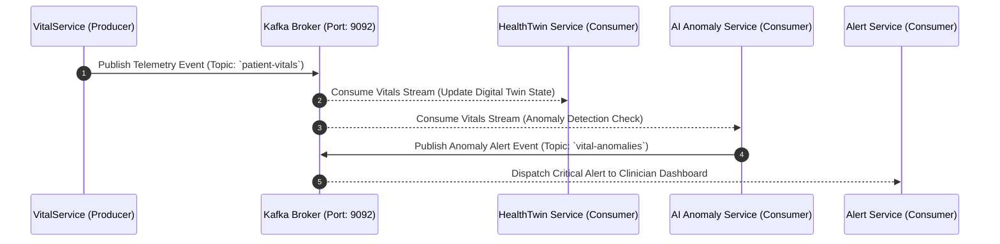

# ⚙️ HealthCare Microservices Backend Ecosystem

<p align="center">
  
  
  
  
  
</p>

---

## 📖 Overview

The **HealthCare Backend Ecosystem** is a distributed, event-driven microservices architecture built on **Java 17** and **Spring Boot 3.x**. It provides high-throughput ingestion of patient telemetry, real-time vital anomaly detection, AI-assisted diagnostic predictions, explainable AI analytics, and personalized clinical care plan management.

All microservices register with a central **Eureka Service Discovery** instance (`eurekaServer`), and external traffic is routed through a resilient **Spring Cloud API Gateway** (`ApiGateway`) with JWT token validation powered by **Keycloak OAuth2**.

---

## 🗂️ Microservices Architecture Matrix

| Service | Directory | Port | Discovery Name | Description | Key Tech Stack |
| :--- | :--- | :---: | :--- | :--- | :--- |
| **Eureka Server** | `eurekaServer/` | `8761` | `EUREKA-SERVER` | Service registry & discovery dashboard | Spring Cloud Netflix Eureka |
| **API Gateway** | `ApiGateway/` | `8089` | `API-GATEWAY` | Central routing gateway & JWT security filter | Spring Cloud Gateway WebFlux, OAuth2 |
| **Auth Service** | `auth-service/` | `8085` | `AUTH-SERVICE` | Keycloak identity sync & user mapping | Spring Security, Keycloak Admin Client |
| **Patient Service** | `Medisphere/` | `8081` | `MEDISPHERE` | Patient registration, medical records & profiles | Spring Data JPA, H2/PostgreSQL |
| **HealthTwin Service** | `HealthTwin/` | `8082` | `HEALTHTWIN` | Digital Twin state aggregator & vital consumer | Spring Boot, Spring Kafka |
| **Vital Service** | `VitalService/` | `8083` | `VITALSERVICE` | Real-time vital signs ingestion & telemetry stream | Spring Boot, Spring Kafka Producer |
| **Consent Service** | `consestService/` | `8084` | `CONSESTSERVICE` | Patient privacy governance & consent policies | Spring Data JPA, REST APIs |
| **AI Predict Service** | `ai-predict/` | `8086` | `AI-PREDICTION-SERVICE` | Microservice bridge to Python Flask ML models | Spring Boot, RestTemplate/WebClient |
| **Diagnostic Service**| `diagnostic-service/`| `8087` | `DIAGNOSTIC-SERVICE` | Clinical diagnostics, lab results & imaging metadata | Spring Data JPA, REST |
| **Audit Service** | `Audit-Microservice/` | `8088` | `AUDIT-MICROSERVICE` | Compliance auditing & operation logging | Spring Boot, Jackson |
| **Explanation Service**| `explanation-service/`| `9093` | `EXPLANATION-SERVICE` | SHAP/LIME Explainable AI feature breakdown | Spring Boot, REST |
| **Simulation Service**| `SIMULATION-SERVICE/`| `9094` | `SIMULATION-SERVICE` | What-if digital twin progression simulations | Spring Boot, Mathematical Algorithms |
| **AI Model Service** | `AI-MODEL-SERVICE/` | `9095` | `AI-MODEL-SERVICE` | ML Model versioning & performance registry | Spring Boot, REST |
| **Diabetes Service** | `DIABETES-SERVICE/` | `9096` | `DIABETES-SERVICE` | Diabetes risk calculations & HbA1c telemetry | Spring Boot, REST |
| **Doctor Service** | `doctor-service/` | `9098` | `DOCTOR-SERVICE` | Doctor dashboards, schedules & patient assignments | Spring Data JPA, REST |
| **Alert Service** | `alert-Service/` | `9191` | `ALERT-SERVICE` | Clinical threshold alert dispatcher & event store | Spring Boot, Spring Kafka Consumer |
| **AI Anomaly Service**| `AI-ANOMALY-SERVICE/`| `9192` | `AI-ANOMALY-SERVICE` | Real-time anomaly detection stream filter | Spring Boot, Kafka Streams / Jackson |
| **CarePlan Service** | `CAREPLAN-SERVICE/` | `9193` | `CAREPLAN-SERVICE` | Medical treatment plan creation & tracking | Spring Data JPA, REST |

---

## 🌐 API Gateway Route Mapping (`ApiGateway`)

The API Gateway running on port `8089` exposes unified REST endpoints that strip path prefixes and proxy requests to microservice instances registered in Eureka:

```
[Client Request] ──> http://localhost:8089/patient/**      ──(StripPrefix=1)──> lb://MEDISPHERE
[Client Request] ──> http://localhost:8089/twin/**         ──(StripPrefix=1)──> lb://HEALTHTWIN
[Client Request] ──> http://localhost:8089/vital/**        ──(StripPrefix=1)──> lb://VITALSERVICE
[Client Request] ──> http://localhost:8089/consent/**      ──(StripPrefix=1)──> lb://CONSESTSERVICE
[Client Request] ──> http://localhost:8089/diagnostic/**   ──(StripPrefix=1)──> lb://DIAGNOSTIC-SERVICE
[Client Request] ──> http://localhost:8089/predict/**      ──(StripPrefix=1)──> lb://AI-PREDICTION-SERVICE
[Client Request] ──> http://localhost:8089/explanations/** ──(StripPrefix=1)──> lb://EXPLANATION-SERVICE
[Client Request] ──> http://localhost:8089/model/**        ──(StripPrefix=1)──> lb://AI-MODEL-SERVICE
[Client Request] ──> http://localhost:8089/diabetes/**     ──(StripPrefix=1)──> lb://DIAGNOSTIC-SERVICE
[Client Request] ──> http://localhost:8089/doctor/**       ──(StripPrefix=1)──> lb://DOCTOR-SERVICE
[Client Request] ──> http://localhost:8089/api/alerts/**   ───────────────────> lb://ALERT-SERVICE
[Client Request] ──> http://localhost:8089/anomaly/**      ──(StripPrefix=1)──> lb://AI-ANOMALY-SERVICE
[Client Request] ──> http://localhost:8089/careplan/**     ──(StripPrefix=1)──> lb://CAREPLAN-SERVICE
```

---

## ⚡ Event-Driven Streaming Architecture (Apache Kafka)

The system uses **Apache Kafka** for asynchronous, fault-tolerant telemetry processing:



---

## 🛠️ Build & Execution Instructions

### Prerequisites
- **Java 17 LTS SDK**
- **Apache Maven 3.8+**
- **Running Kafka Broker** (`localhost:9092`)
- **Running Keycloak Broker** (`localhost:9090`)

### Building All Microservices
From the `HealthCare_BackEnd` root folder, compile all microservices:

```bash
# Windows PowerShell / CMD
mvn clean install -DskipTests
```

### Launch Sequence
> [!IMPORTANT]
> Microservices must be started in the following order to ensure proper registration:

1. **Service Discovery (Eureka)**:
   ```bash
   cd eurekaServer
   mvn spring-boot:run
   ```
2. **API Gateway**:
   ```bash
   cd ApiGateway
   mvn spring-boot:run
   ```
3. **Core Services**: Launch `auth-service`, `Medisphere`, `HealthTwin`, `VitalService`, `doctor-service`, etc.

---

<p align="center">
  <sub>HealthCare Microservice Backend • Architected for Scale & Reliability</sub>
</p>
