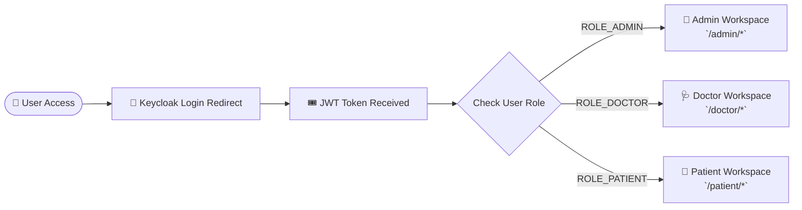

# 💻 Healthcare Platform Frontend & AI Prediction Engine

<p align="center">
  
  
  
  
  
</p>

---

## 📖 Overview

The `Healthcare_frontend` sub-repository houses the user interface applications and the dedicated Python AI Inference service:

1. **`healthtwin-ui`**: A high-performance, responsive single-page web application (SPA) built with **React 19**, **Vite**, **Framer Motion**, and **Tailwind CSS**. It incorporates role-based UI interfaces for **Administrators**, **Clinicians (Doctors)**, and **Patients**.
2. **`Medisphere_AI`**: A specialized **Python Flask micro-service** that hosts pre-trained machine learning models for disease risk scoring (Heart Disease, Diabetes, Vital Anomaly predictions).

---

## 🎨 Design System & Visual Architecture

The frontend application uses a bespoke, unified design system defined around core utility classes and Framer Motion micro-animations:

- **`page-card`**: Sleek container cards with soft drop-shadows and subtle glassmorphic borders.
- **`page-header`**: Standardized hero section with title, subtitle, status indicators, and actions.
- **`stat-card`**: Elevated metric tiles with hover-lift micro-interactions for key health metrics (BMI, Vitals, Risk Scores).
- **`page-status-chip`**: Contextual badge system (`brand`, `success`, `warning`, `danger`) for clinical status indicators.
- **`soft-card`**: Subdued background panels for embedded chart visualizations and risk breakdown components.

---

## 🔐 Keycloak Authentication & Role-Based Routing

The frontend integrates directly with **Keycloak 26** via `keycloak-js`. The application extracts client roles from the JWT token and dynamically renders role-specific dashboard navigation:



---

## 🖥️ Page Layout & Route Breakdown

### 👑 Admin Portal Pages (`src/pages/admin/`)
- `Dashboard.jsx`: Overall operational statistics and active microservice monitors.
- `Patients.jsx` & `PatientDetails.jsx`: Comprehensive patient management and medical record viewer.
- `Doctors.jsx` & `AddDoctor.jsx`: Doctor registry management and onboarding form.
- `HealthTwins.jsx` & `EditHealthTwin.jsx`: Digital Twin administration and metric overrides.
- `AIPrediction.jsx`: Global AI model inference execution and risk analytics.
- `ModelManagement.jsx`: ML model versioning, retraining status, and performance metrics.
- `CarePlans.jsx`: System-wide care plan templates and assignment logs.
- `Alert.jsx` & `Anomaly.jsx`: Real-time system alert feeds and telemetry anomaly streams.

### 🩺 Doctor Portal Pages (`src/pages/doctor/`)
- `Dashboard.jsx`: Assigned patient summary, upcoming consultations, and high-risk alerts.
- `Patients.jsx` & `Patient360.jsx`: Deep-dive 360° clinical view of patient history, vitals, and diagnostics.
- `HealthTwin.jsx`: Clinician-focused Digital Twin visualizer with dynamic vital sign gauges.
- `AiPrediction.jsx`: Interactive risk predictor with SHAP feature breakdown charts.
- `CarePlans.jsx`: Custom patient care plan builder and progress tracking.
- `Alerts.jsx` & `Anomaly.jsx`: Immediate notification center for patient vital threshold breaches.

### 👤 Patient Portal Pages (`src/pages/patient/`)
- `HealthTwin.jsx`: Personal digital health twin visualization showing BMI, Vitals, and Health Score.
- `Patient360.jsx`: Personal health history, laboratory results, and medical summary.
- `Consents.jsx`: Granular privacy control panel to grant or revoke doctor access to medical records.
- `PatientCarePlan.jsx`: Interactive daily health action plan, medication schedule, and wellness tasks.
- `PatientAiPrediction.jsx` & `PatientDiabetesPrediction.jsx`: Patient-friendly AI health risk assessments.
- `Alerts.jsx`: Personal notification center for appointment reminders and health warnings.

---

## 🐍 Python AI Engine (`Medisphere_AI`)

The `Medisphere_AI` sub-system contains the Flask API wrapper, pre-trained Scikit-Learn model artifacts, and datasets:

- **`Medisphere_AI/predictor/app.py`**: Flask server listening on `http://localhost:5000`.
- **`Medisphere_AI/models/`**: Serialized `.pkl` models (Heart Disease Classifier, Diabetes Risk Model, Vital Anomaly Detector).
- **`Medisphere_AI/train/`**: Scripts for dataset preprocessing, model evaluation, and export.

### AI Engine API Endpoints

| Method | Endpoint | Description |
| :--- | :--- | :--- |
| `POST` | `/predict/heart` | Returns heart disease probability score and risk factor weights |
| `POST` | `/predict/diabetes` | Calculates diabetes risk score based on glucose, BMI, age, and insulin |
| `POST` | `/predict/vitals-anomaly` | Evaluates multi-parameter vital sign streams for physiological anomalies |

---

## 🛠️ Development & Running Instructions

### Running the React Frontend (`healthtwin-ui`)

1. Navigate to the UI directory:
   ```bash
   cd Healthcare_frontend/healthtwin-ui
   ```

2. Install dependencies:
   ```bash
   npm install
   ```

3. Start Vite Development Server:
   ```bash
   npm run dev
   ```
   *Access the web app at `http://localhost:5173`.*

4. Verification & Quality Checks:
   ```bash
   # Run ESLint validation
   npm run lint

   # Build production bundle
   npm run build
   ```

---

### Running the Python AI Engine (`Medisphere_AI`)

1. Navigate to the AI directory:
   ```bash
   cd Healthcare_frontend/Medisphere_AI
   ```

2. Set up virtual environment:
   ```bash
   python -m venv venv
   # Windows:
   .\venv\Scripts\activate
   # Linux/macOS:
   source venv/bin/activate
   ```

3. Install required packages:
   ```bash
   pip install -r requirements.txt
   ```

4. Launch Flask API Server:
   ```bash
   python predictor/app.py
   ```

---

<p align="center">
  <sub>Healthcare Frontend & AI Engine • Powered by React 19, Tailwind CSS & Flask</sub>
</p>
